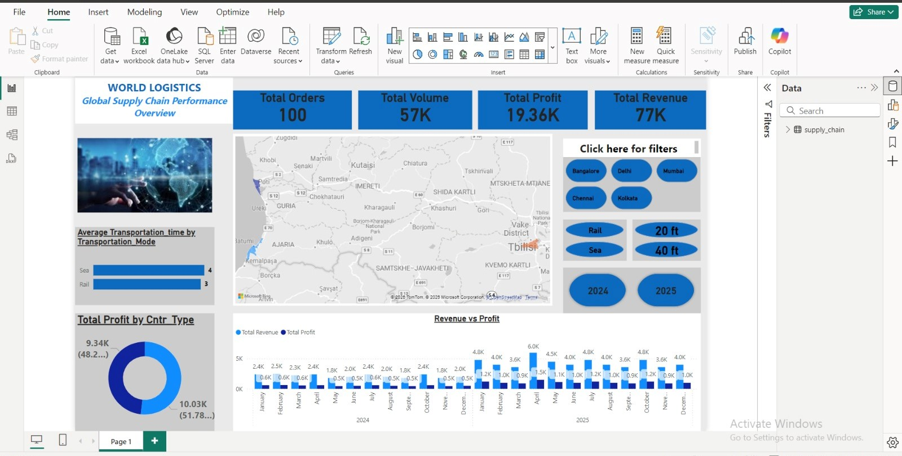

# 🚢 World Logistics Performance Analysis Dashboard (2024-2025)

## 📊 Project Overview
This project presents an **End-to-End Logistics Analytics** solution designed to monitor and optimize global supply chain operations. It covers the entire data lifecycle, from raw data extraction using **SQL** to advanced data transformation and interactive visualization in **Power BI**.

## 🛠️ Tech Stack & Skills Applied
*   **SQL:** Data extractionand initial data cleaning/filtering.
*   **Power Query (ETL):** Advanced data transformationand data type formatting.
*   **DAX (Data Analysis Expressions):** Developed custom measures for key metrics such as Total Revenue ($77K), Total Profit ($19.3K), and Order Volume.
*   **Data Modeling:** Established a time-series hierarchy for a comprehensive 2-year trend analysis (2024-2025).
*   **Power BI Visualization:** Designed an interactive UI featuring geographic mapping, profitability analysis, and operational efficiency tracking.

## 🚀 Key Business Insights
*   **Financial Performance:** Identified that **March** was the most profitable month, while analyzing seasonal drops in **September** and **November**.
*   **Operational Efficiency:** Evaluated **Transportation Lead Times** (Sea vs. Rail), providing a clear comparison of delivery speed across different shipping modes.
*   **Geographic Reach:** Visualized the logistics network across key regions including India, Pakistan, Nepal, and Bangladesh.
*   **Equipment Optimization:** Analyzed profit distribution between **20ft and 40ft containers**, showing a near-equal split (51.78% vs 48.22%) in revenue contribution.

## 📈 Dashboard Preview
 

---
**Created by Gvantsa| Logistics Data Analyst**
